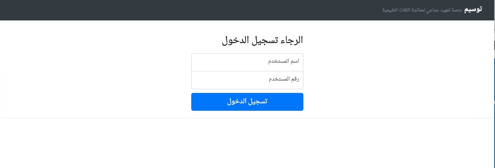
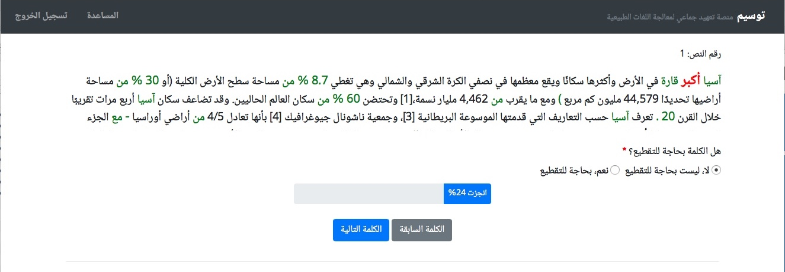
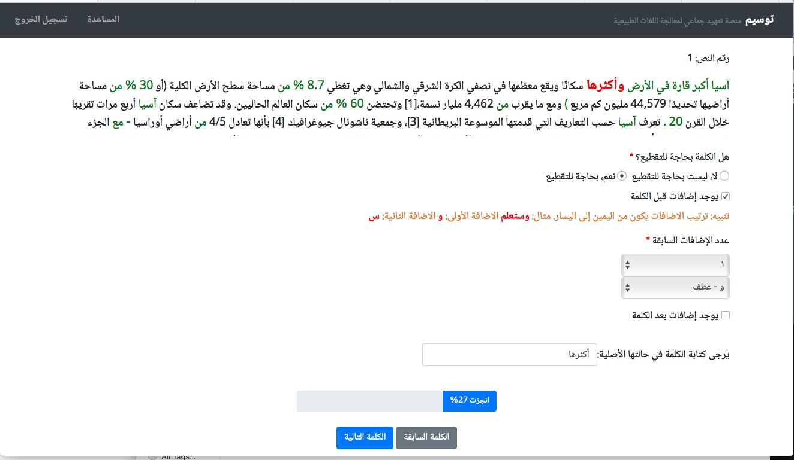
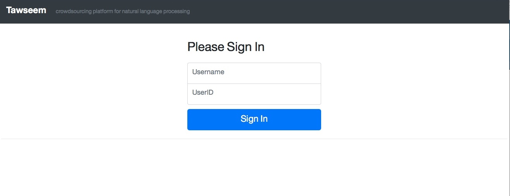
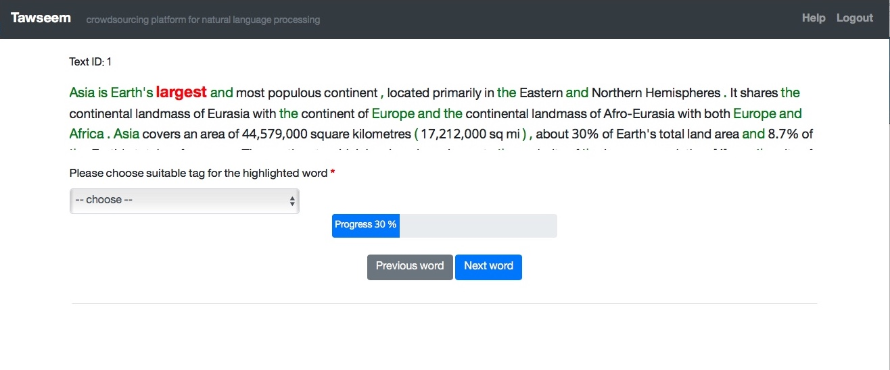
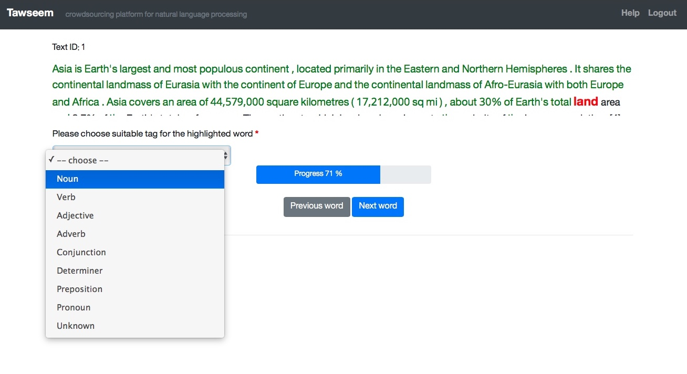

# Tawseem: NLP crowdsourcing platform for word-level annotations. 


Tawseem (توسيم) is a web application for crowdsourcing basic word-level NLP annotations tasks, such as word segmentation and part of speech tagging. This manual processing is perhaps required for building training datasets from ground up, to be used in NLP train-based systems.

Tawseem was built primarily for Arabic word segmentation. However, I have tried to make it easier to extend functionality and language support. For illustration, a POS tagging job for English was created (read on for instructions on such extension).

## Tools and Dependencies:
- Golang: for running server code (tested on version 1.12).
- Bootstrap (v4) , [bootstrap RTL](https://github.com/MahdiMajidzadeh/bootstrap-v4-rtl).
and Javascript (jquery): for web pages aesthetics and functionality.
- SQLite: for storage.
- Java: for loading data from text files to DB.


## Database Structure

Tawseem use case(s) perhaps was better suited for NO SQL. However, our original use case was structured enough, hence the SQL choice.  Below is the schema:

```
CREATE TABLE texts (t_id INTEGER PRIMARY KEY ,content TEXT,processed INTEGER)
CREATE TABLE users (u_id INTEGER PRIMARY KEY ,username TEXT)
CREATE TABLE words (w_seq INTEGER NOT NULL,  text_id INTEGER NOT NULL, word TEXT, pr1 TEXT, pr2 TEXT, pr3 TEXT, pr4 TEXT,stm TEXT, sf1 TEXT, sf2 TEXT, sf3 TEXT, sf4 TEXT, processed INTEGER, FOREIGN KEY(text_id) REFERENCES texts(t_id),PRIMARY KEY (w_seq, text_id))
CREATE TABLE workson (user_id INTEGER NOT NULL, text_id INTEGER NOT NULL, FOREIGN KEY (user_id) REFERENCES users(u_id), FOREIGN KEY (text_id) REFERENCES texts(t_id), PRIMARY KEY (user_id, text_id))
```
- "texts" table holds the original text that needs processing, and "processed" flag indicate status.
- The text stored in "content" should be segmented and stored in "words". The most important (and fixed) columns in "words" are:"w_seq"(the index),"word,"processed"(flag),"text_id". The remaining columns are customized according to use case. For example: in word segmentation job, you may want to collect word prefixes and postfixes. in POS tagging, you would want to collect the word tag.
- Each user should be assigned to one text at a time. This relationship is stored in "workson".

## Server code (server.go)

- server.go has one external dependency: [sqlite driver](https://github.com/mattn/go-sqlite3).
- Main function will listen to 4 urls: /login/  /  /help/ /logout/
- The server uses basic session mechanism: store cookies on client after successful login and destroy the session after some time of inactivity.
- server.go accepts three arguments:
   1. sqlite file path.
   2. the templates folder path.
   3. the function name that is used to process user form submission.
- Templates folder must contain all the .html files used by server.go (those files should be customized according to usage (ie. loading bootstrap-rtl.css for RTL language)).

## Loading data to DB

You can use any of the Java files inside loader folder (I've created two because of my uses cases, see examples below)

There are 2 dependencies: [jdbc.jar](https://github.com/xerial/sqlite-jdbc) - [opencsv.jar](https://sourceforge.net/projects/opencsv/)

java program accepts two arguments:
1. Sqlite file path.
2. Path to a folder containing the text files.

The loader will collect text files inside the provided directory path, then insert them to db (to texts and words tables).
There is an option to white-flag specific words, and mark them as pre-processed. You can use csv files as a white-flag list or regular expressions.


## Extending language support/functionality:
Follow those steps:

1. Change only the "words" table structure to match your needs. However you have to retain certain columns (explained above in DB section).
2. Edit the java loader (you may only need to change how insertion to "words" table is done)
3. Prepare your templates files inside a directory (use your preferred language for static text inside .html files)
4. Override the template file "user_form.html" to control what is submitted by users.
5. Implement your go function that parses the user form. It should have a specific signature (see variable parse_form_function in source code for details)


## Examples 

### Example1: build and Run word segmentation job for Arabic language: 
```
cd loader
javac -cp ".:jdbc.jar:opencsv.jar" LoaderSeg.java
java -cp ".:jdbc.jar:opencsv.jar" LoaderSeg ../seg_ar.sqlite sample_data_ar
cd ..
go build server.go
./server ./seg_ar.sqlite ./templates/ar Parse_seg
```

### Example2: build and run POS tagging job for English:
```
cd loader
javac -cp ".:jdbc.jar:opencsv.jar" LoaderPos.java
java -cp ".:jdbc.jar:opencsv.jar" LoaderPos ../pos_en.sqlite sample_data_en
cd ..
go build server.go
./server pos_en.sqlite ./templates/en Parse_pos
```


## Screenshots









## Final notes
- Tawseem was built without security in mind (you may have noticed this already). The initial objective is to run it in closed or semi-closed environment. If you want to run it publicly just keep this in mind.
- Tawseem was developed for research purposes (obviously). Special thanks for Dr.AbdulMohsen Al-Thubaity  for his original idea in suggesting implementing such platform & supervision throughout the process.
- The provided sample text files are derived from wikipedia articles.
